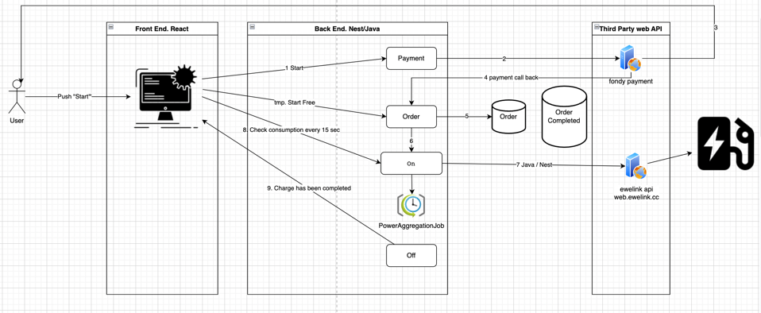

# Project to transform you garage or any public spot to electric car charging station.

#Setup dev env:
1. install java 17
2. run: ./gradlew clean build
3. our chat: https://discord.gg/hRwCF5jYvj
4. Kanban board: https://esound.youtrack.cloud/youtrack/agiles/87-6/current

#SDLC:
1. We push to master -> deployment happens every 20 mins to http://220-km.com/
2. If deployment broken use last tag https://github.com/maxpavlovdp/activecharge/releases/tag/v1.1

#Design:

